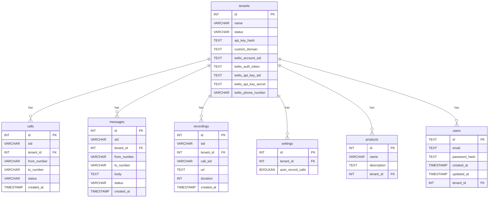

# Database Schema Design for Multi-Tenant Architecture

This document outlines the detailed database schema design for implementing the multi-tenant architecture, based on the summary provided in `solution.md`.

## 1. New Tables

The following new tables will be created to support the multi-tenant architecture.

### 1.1. `tenants`

This table will store tenant-specific information, including Twilio credentials. It merges the existing `tenants` table with the proposed changes.

```sql
CREATE TABLE tenants (
    id SERIAL PRIMARY KEY,
    name VARCHAR(256) NOT NULL,
    status VARCHAR(50) NOT NULL, -- 'active', 'inactive'
    api_key_hash TEXT NOT NULL,
    custom_domain TEXT UNIQUE,
    twilio_account_sid TEXT,
    twilio_auth_token TEXT, -- Encrypted
    twilio_api_key_sid TEXT,
    twilio_api_key_secret TEXT, -- Encrypted
    twilio_phone_number VARCHAR(20)
);
```

### 1.2. `calls`

This table will store call records for each tenant.

```sql
CREATE TABLE calls (
    id SERIAL PRIMARY KEY,
    sid VARCHAR(34) UNIQUE NOT NULL,
    tenant_id INTEGER NOT NULL REFERENCES tenants(id) ON DELETE CASCADE,
    from_number VARCHAR(20),
    to_number VARCHAR(20),
    status VARCHAR(20),
    created_at TIMESTAMP WITH TIME ZONE DEFAULT NOW()
);
```

### 1.3. `messages`

This table will store message records for each tenant.

```sql
CREATE TABLE messages (
    id SERIAL PRIMARY KEY,
    sid VARCHAR(34) UNIQUE NOT NULL,
    tenant_id INTEGER NOT NULL REFERENCES tenants(id) ON DELETE CASCADE,
    from_number VARCHAR(20),
    to_number VARCHAR(20),
    body TEXT,
    status VARCHAR(20),
    created_at TIMESTAMP WITH TIME ZONE DEFAULT NOW()
);
```

### 1.4. `recordings`

This table will store call recording information for each tenant.

```sql
CREATE TABLE recordings (
    id SERIAL PRIMARY KEY,
    sid VARCHAR(34) UNIQUE NOT NULL,
    tenant_id INTEGER NOT NULL REFERENCES tenants(id) ON DELETE CASCADE,
    call_sid VARCHAR(34),
    url TEXT,
    duration INTEGER,
    created_at TIMESTAMP WITH TIME ZONE DEFAULT NOW()
);
```

### 1.5. `settings`

This table will store tenant-specific settings.

```sql
CREATE TABLE settings (
    id SERIAL PRIMARY KEY,
    tenant_id INTEGER UNIQUE NOT NULL REFERENCES tenants(id) ON DELETE CASCADE,
    auto_record_calls BOOLEAN DEFAULT FALSE
);
```

## 2. Modifications to Existing Tables

The following existing tables will be modified to include a `tenant_id` for data isolation.

### 2.1. `products`

```sql
ALTER TABLE products ADD COLUMN tenant_id INTEGER NOT NULL REFERENCES tenants(id) ON DELETE CASCADE;
```

### 2.2. `users`

```sql
ALTER TABLE users ADD COLUMN tenant_id INTEGER NOT NULL REFERENCES tenants(id) ON DELETE CASCADE;
```

## 3. Relationships

The following Mermaid diagram illustrates the relationships between the tables in the new schema.


