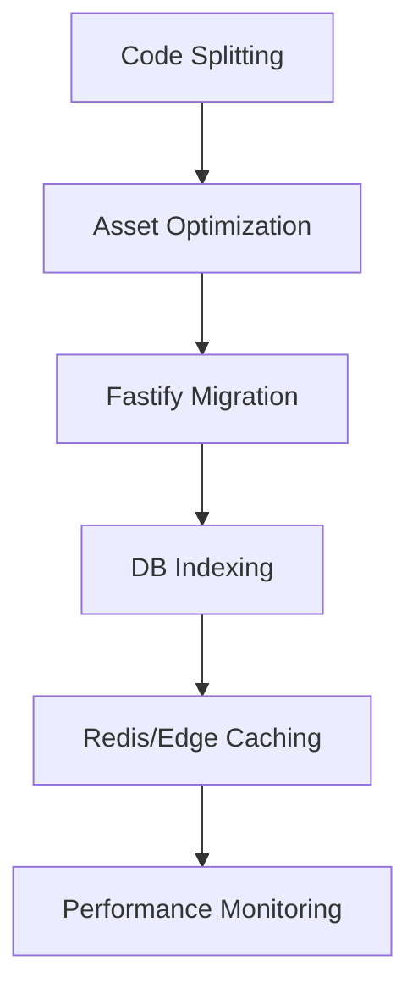

# Performance Improvement Plan - Fallowl Parallel Dialer

This document outlines the strategy for optimizing the application's performance, focusing on load speed, runtime efficiency, and backend responsiveness.

## 1. Performance Audit Findings

### Frontend (React/Vite)
*   **Large Monolithic Bundle**: All 28+ pages are imported statically in [`Layout.tsx`](client/src/components/layout/Layout.tsx), leading to a massive initial payload.
*   **Asset Management**: Multiple high-resolution images in `attached_assets/` are being served without optimization or CDN delivery.
*   **State Management**: Extensive use of `zustand` and `react-query` without granular component memoization may lead to unnecessary re-renders in complex views like the Parallel Dialer.
*   **Missing PWA/Caching**: No Service Worker implementation for offline capabilities or asset caching.

### Backend (Fastify/Node.js)
*   **Incomplete Migration**: Hybrid Express/Fastify setup adds overhead. 210/214 routes still use the Express bridge.
*   **Database Queries**: [`storage.ts`](server/storage.ts) uses `db.select().from(table)` frequently, which may fetch unnecessary columns. Lack of explicit indexing for high-frequency filters (e.g., `tenantId`, `userId`, `phone`).
*   **Large File Handling**: Local storage of recordings and logs instead of optimized object storage.
*   **Rate Limiting Overhead**: Multiple rate limiters per route might impact latency if not finely tuned.

---

## 2. Technical Specification & Strategy

### Phase 1: Frontend Optimization
*   **Implementation of Code Splitting**: Convert static imports to `React.lazy()` with `Suspense` in [`Layout.tsx`](client/src/components/layout/Layout.tsx).
*   **Asset Pipeline**:
    *   Compress PNG/JPG assets to WebP format.
    *   Implement lazy loading for images.
*   **Bundle Analysis**: Integrate `rollup-plugin-visualizer` to identify and trim large dependencies.

### Phase 2: Backend & Database Optimization
*   **Accelerated Fastify Migration**: Complete the migration of high-traffic routes (Contacts, Calls, Leads) to native Fastify plugins to remove the Express bridge overhead.
*   **Query Optimization**:
    *   Refactor `storage.ts` to use `.select({ column1: table.column1 })` for specific data needs.
    *   Audit and add missing indexes on foreign keys and search columns (`phone`, `email`).
*   **Compression**: Enable `@fastify/compress` for all API responses.

### Phase 3: Infrastructure & Caching
*   **Edge Caching**: Configure CDN (BunnyCDN/Cloudfront) for static assets and recordings.
*   **In-Memory Caching**: Implement Redis or `lru-cache` for frequently accessed settings and role permissions in `storage.ts`.
*   **Production Build Tuning**: Optimize `esbuild` and `vite` configuration for better tree-shaking.

---

## 3. Performance Targets (KPIs)

| Metric | Target |
| :--- | :--- |
| First Contentful Paint (FCP) | < 1.2s |
| Largest Contentful Paint (LCP) | < 2.5s |
| Time to Interactive (TTI) | < 3.0s |
| API Response Time (P95) | < 150ms |
| Initial Bundle Size (Gzip) | < 250KB |

---

## 4. Implementation Todo List

### Proposed Changes
1.  **Split Bundle**: Refactor [`Layout.tsx`](client/src/components/layout/Layout.tsx) to use dynamic imports.
2.  **Optimize Storage**: Modify [`storage.ts`](server/storage.ts) to include database indexing scripts.
3.  **Fastify Plugins**: Move `contactsRoutes` and `callsRoutes` to native Fastify.
4.  **Vite Config**: Update [`vite.config.ts`](vite.config.ts) for aggressive chunking.
