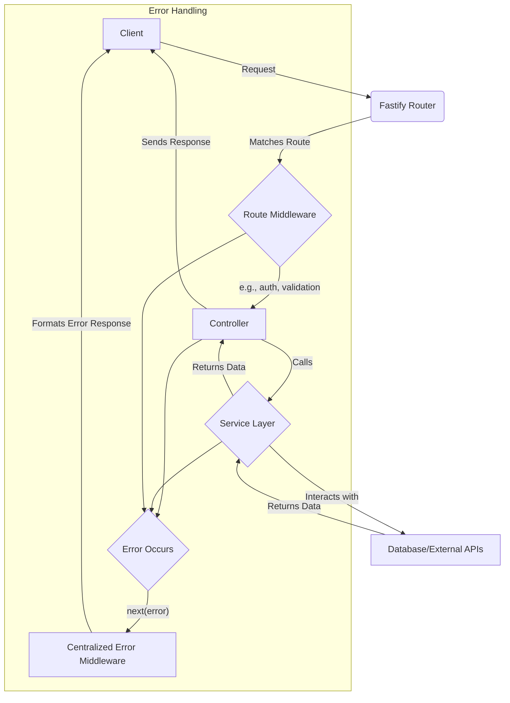

# Routes and Controllers Refactoring Plan

## 1. Introduction

This document outlines the plan for refactoring the existing routes and controllers to align with the new service layer architecture. The primary goal is to improve separation of concerns, enhance testability, and create a more maintainable and scalable codebase.

## 2. Guiding Principles

*   **Thin Controllers**: Controllers should be lightweight and responsible only for request/response handling, input validation, and calling services.
*   **Fat Services**: All business logic should reside in the service layer.
*   **Dependency Injection**: Services will be injected into controllers to promote loose coupling and testability.
*   **Consistent Error Handling**: A centralized error handling mechanism will be used for consistent error responses.
*   **Standardized Response Format**: All API responses will follow a consistent JSON format (e.g., `{ "data": ..., "error": ... }`).

## 3. Directory Structure

The `server` directory will be reorganized to group features by domain. Each domain will have its own `controller`, `routes`, and `service` files.

```
server/
├── api/
│   ├── auth/
│   │   ├── auth.controller.ts
│   │   └── auth.routes.ts
│   ├── users/
│   │   ├── users.controller.ts
│   │   └── users.routes.ts
│   └── ... (other domains)
├── services/
│   ├── TenantService.ts
│   ├── UserService.ts
│   └── ... (other services)
├── middleware/
│   ├── auth.ts
│   └── ... (other middleware)
└── index.ts
```

## 4. Refactoring Strategy

The refactoring will be done on a per-route basis to minimize disruption.

1.  **Identify a Route**: Select a route to refactor (e.g., `GET /api/users`).
2.  **Create Controller**: Create a corresponding controller (e.g., `users.controller.ts`).
3.  **Move Logic to Service**: Move the business logic from the route handler to a method in the appropriate service (e.g., `UserService.getUsersByTenant`).
4.  **Implement Controller Method**: Create a method in the controller that calls the service method. This method will handle the request and response.
5.  **Update Route**: Update the route handler to call the new controller method.
6.  **Add Authentication**: Apply authentication and authorization middleware to the route.

## 5. Authentication and Authorization

*   **JWT-based Authentication**: We will use JSON Web Tokens (JWT) for securing endpoints.
*   **`auth` Middleware**: A new `auth` middleware will be created to verify the JWT and attach the user and tenant information to the request object. This middleware will be applied to all protected routes.
*   **Role-Based Access Control (RBAC)**: A simple RBAC system will be implemented. The `auth` middleware will check the user's role and permissions against the required permissions for the endpoint.

## 6. New `auth` Controller

A new `auth` controller will be created to handle user registration and login.

**`auth.controller.ts`**
```typescript
class AuthController {
  constructor(private authService: AuthService) {}

  async register(req, res, next) {
    try {
      const { email, password, tenantName } = req.body;
      const result = await this.authService.register(email, password, tenantName);
      res.status(201).send({ data: result });
    } catch (error) {
      next(error);
    }
  }

  async login(req, res, next) {
    try {
      const { email, password } = req.body;
      const token = await this.authService.login(email, password);
      res.send({ data: { token } });
    } catch (error) {
      next(error);
    }
  }
}
```

## 7. Error Handling

*   A centralized error handling middleware will be implemented.
*   Custom error classes (e.g., `NotFoundError`, `UnauthorizedError`) will be created to represent specific error scenarios.
*   The error handling middleware will catch errors and send a standardized JSON error response.

## 8. Mermaid Diagram: New Request Flow



## 9. Todo List

- [ ] Create the new directory structure for API routes and controllers.
- [ ] Implement the centralized error handling middleware.
- [ ] Create custom error classes.
- [ ] Implement the JWT-based authentication middleware.
- [ ] Implement the `auth` controller and service for registration and login.
- [ ] Refactor the `users` routes and create a `users` controller.
- [ ] Refactor the `tenants` routes and create a `tenants` controller.
- [ ] Refactor the `twilio` routes and create a `twilio` controller.
- [ ] Update all routes to use the new service layer and error handling.
- [ ] Write unit tests for the new controllers and services.
- [ ] Write integration tests for the refactored API endpoints.

