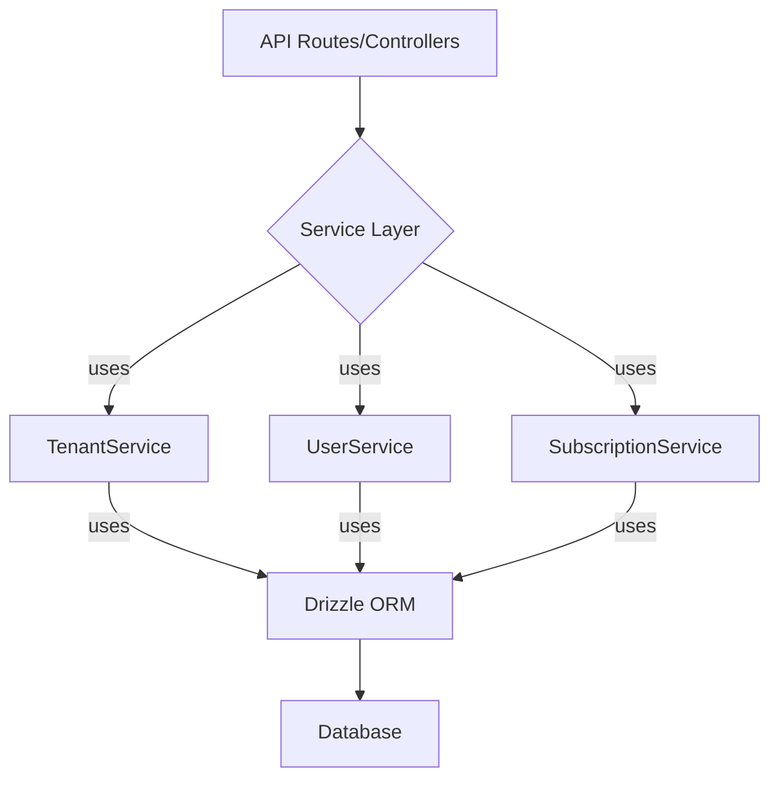

# Service Layer Architecture Plan

This document outlines the detailed plan for implementing a new service layer for the multi-tenant application.

## 1. Goals

*   To create a clear separation of concerns between business logic and the presentation layer (controllers/routes).
*   To establish a consistent pattern for database connections and transactions.
*   To design a flexible and scalable service layer that can be easily tested and maintained.
*   To implement a dependency injection strategy for managing service dependencies.

## 2. Directory Structure

The new service layer will reside in the `server/services` directory. Each service will have its own file.

```
server/
└── services/
    ├── TenantService.ts
    ├── UserService.ts
    ├── SubscriptionService.ts
    └── index.ts // To export all services
```

## 3. Dependency Injection

We will use a constructor-based dependency injection pattern. This will make our services easy to test, as we can inject mock dependencies. We will create a simple dependency injection container to manage the instantiation of services and their dependencies.

**Example (`TenantService.ts`):**

```typescript
import { DrizzleClient } from '../db';
import { UserRepository } from '../repositories/UserRepository';

export class TenantService {
  private db: DrizzleClient;
  private userRepository: UserRepository;

  constructor(db: DrizzleClient, userRepository: UserRepository) {
    this.db = db;
    this.userRepository = userRepository;
  }

  // ... service methods
}
```

## 4. Database Connection and Transaction Management

*   A single Drizzle ORM instance will be created and shared across the application.
*   Services will receive the Drizzle instance via dependency injection.
*   For operations that require multiple database writes, we will use Drizzle's transaction API to ensure data integrity.

**Example Transaction in a Service:**

```typescript
  async createTenantAndUser(tenantName: string, userEmail: string) {
    return this.db.transaction(async (tx) => {
      const newTenant = await tx.insert(tenants).values({ name: tenantName }).returning();
      const newUser = await tx.insert(users).values({ email: userEmail, tenantId: newTenant[0].id }).returning();
      return { tenant: newTenant[0], user: newUser[0] };
    });
  }
```

## 5. Service Class Design

### `TenantService`

**Responsibilities:** Managing tenants, including their creation, retrieval, and Twilio credential management.

```typescript
class TenantService {
  /**
   * Creates a new tenant.
   */
  createTenant(name: string): Promise<Tenant>;

  /**
   * Retrieves a tenant by its ID.
   */
  getTenantById(tenantId: number): Promise<Tenant | null>;

  /**
   * Updates a tenant's Twilio credentials.
   * Credentials will be encrypted before being stored.
   */
  updateTwilioCredentials(
    tenantId: number,
    credentials: { accountSid: string; authToken: string; apiKeySid: string; apiKeySecret: string }
  ): Promise<void>;

  /**
   * Retrieves and decrypts a tenant's Twilio credentials.
   */
  getTwilioCredentials(tenantId: number): Promise<{ accountSid: string; authToken: string; apiKeySid: string; apiKeySecret: string } | null>;
}
```

### `UserService`

**Responsibilities:** Managing users within a tenant.

```typescript
class UserService {
  /**
   * Creates a new user for a given tenant.
   */
  createUser(tenantId: number, userData: { email: string; name: string; }): Promise<User>;

  /**
   * Retrieves a user by their ID.
   */
  getUserById(userId: number): Promise<User | null>;

  /**
   * Retrieves all users for a given tenant.
   */
  getUsersByTenant(tenantId: number): Promise<User[]>;
}
```

### `SubscriptionService`

**Responsibilities:** Managing tenant subscriptions and billing.

```typescript
class SubscriptionService {
  /**
   * Creates a new subscription for a tenant.
   */
  createSubscription(tenantId: number, planId: string): Promise<Subscription>;

  /**
   * Retrieves a tenant's subscription.
   */
  getSubscriptionByTenant(tenantId: number): Promise<Subscription | null>;

  /**
   * Cancels a tenant's subscription.
   */
  cancelSubscription(tenantId: number): Promise<void>;
}
```

## 6. Interaction Diagram

This diagram illustrates how the different layers of the application will interact.


